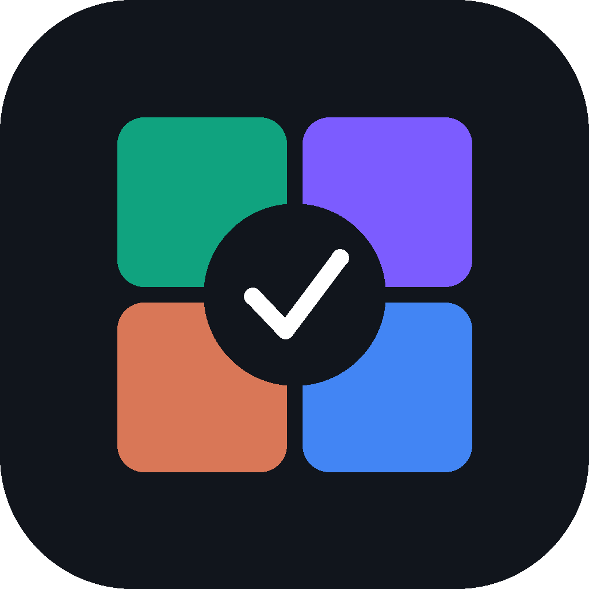

<p align="center">
  
</p>

<h1 align="center">Council Editor</h1>

<p align="center">
  A desktop workspace for solving, reviewing, and improving technical answers with a multi-model council and a dedicated coding workspace.
</p>

<p align="center">
  <strong>macOS desktop</strong> · <strong>Tauri</strong> · <strong>Next.js</strong> · <strong>Rust</strong> · <strong>TypeScript</strong>
</p>

---

## Overview

Council Editor is a private desktop application built for code review, algorithm problems, technical reasoning, and structured answer comparison. It lets multiple configured models read the same input, solve independently, compare their outputs, and produce a clearer final result.

The app is designed around two major workspaces:

- **Council**: runs multiple models in parallel, compares their answers, executes generated code when needed, reviews disagreements, and synthesizes a final answer.
- **Coding**: works against a selected local project folder, creates an implementation plan first, then applies code changes only after the plan is approved.

Secrets stay local through the macOS Keychain, and file-changing coding tools stay rooted to the project folder selected in the app.

## Features

- Multi-pane model runs for independent answers.
- Screenshot, paste, and file-based problem input.
- Consensus scoring across answer, claims, and code structure.
- Council mode with solver, reviewer, judge, and synthesis passes.
- Program execution checks for generated solutions.
- Dedicated Coding workspace with project-folder targeting.
- Plan-first coding flow with explicit approval before file mutation.
- Tool timeline, todos, diffs, pause, and continue controls.
- Local run history and background job visibility.
- macOS global shortcuts for capture and execution.
- Settings-driven model configuration.
- Keychain-backed provider and gateway credentials.
- Tauri desktop packaging for macOS.

## Workspaces

### Council

The Council workspace is for questions, screenshots, coding problems, and review tasks that benefit from independent model comparison.

Typical flow:

1. Add a screenshot, pasted image, or prompt.
2. Run the configured model panes.
3. Each pane produces its own answer.
4. The app parses structured final blocks.
5. Consensus scoring groups matching answers.
6. Optional judge and council passes review weak or conflicting outputs.
7. The final answer appears in the solution panel with supporting evidence.

For coding problems, the Council can also generate test harnesses, execute candidate code, reject failing solutions, and synthesize a stronger final implementation.

### Coding

The Coding workspace is for making changes inside a selected project folder.

Typical flow:

1. Choose the project folder in Settings.
2. Select the coding model in Settings.
3. Open the Coding workspace.
4. Ask for the change in the chat-style input.
5. Generate or refine the plan.
6. Approve the plan.
7. The coding agent reads, edits, and reports changes inside the selected project root.

The workspace keeps the experience focused: the project name is shown clearly, status is simple, and model/token controls stay in Settings.

## Keyboard Shortcuts

| Shortcut | Action |
|---|---|
| `Control+7` | Capture a screen region from anywhere |
| `Control+8` | Run the loaded task |
| `Command+Enter` | Run from the focused app window |
| `Command+,` | Open Settings |

Background capture helpers can also be configured for batch-style capture and submit workflows.

### Background helper overlay shortcuts

When the installed background helper is running, these are the overlay test shortcuts:

| Shortcut | Action |
|---|---|
| `Control+Option+C` | Toggle the coding overlay |
| `Control+Option+M` | Toggle the MCQ overlay |
| `Control+Option+B` | Start a helper capture batch |
| `Control+Option+P` | Capture the current screen into the helper batch |
| `Control+Option+Return` | Submit the helper batch |
| `Shift+Option+Arrow Keys` | Move the visible helper overlay |
| `Option+Up / Option+Down` | Scroll the visible helper overlay |

## Planned Feature: PrivateTrigger iOS Companion

**Status: Planned — not yet implemented.** Council Editor will support a dedicated native iPhone remote-control app, developed as an iOS feature of the Council Editor project. Its companion protocol may also be reusable by the separate [PrivateTrigger project](https://github.com/4cyberlord/PrivateTrigger), but this specification belongs to **Council Editor**.

### Purpose and requirements

- Build a local-first **SwiftUI iOS controller** for a paired Mac running Council Editor.
- Deliver **named commands directly** to authenticated native handlers, **never** by sending synthetic keyboard events or triggering the existing shortcut combinations.
- Discover the Mac on the local network with Bonjour and connect using the Apple Network framework over authenticated TLS. Pair explicitly using a short-lived challenge, verify the device identity, and keep credentials in Keychain on both devices.
- A separately installed, authorized macOS helper should receive commands even when the main Council Editor window is closed. Existing permission and helper-lifecycle requirements still apply.
- Prefer LAN-only operation for v1. Optional remote relay and internet access are future features, not default behavior.
- Provide connection state, acknowledgements, per-command results, activity history, cancellation where supported, and a Mac-side emergency disconnect/revocation control.
- No external keyboard monitoring application receives a *Mac shortcut* for commands initiated from the iPhone because those shortcuts are not pressed. This does **not** guarantee that privileged software cannot observe app activity or the effects of a command.

### Architecture

```text
PrivateTrigger iPhone app (SwiftUI)
          |
          | Bonjour discovery + mutually authenticated encrypted connection
          v
Council Editor macOS background helper / remote command receiver
          |
          | verified command ID + per-action authorization
          v
Native capture / batch / solve / overlay / coding / workspace handlers
          |
          +---- acknowledgement, status, and consented results ----> iPhone
```

### iPhone sections and command registry

These are **proposed remote protocol commands**; some target existing desktop features, while status, cancellation, reset, and selected remote workflows need new adapters.

| iPhone section | Command | Behavior |
| --- | --- | --- |
| **Screenshots** | `capture.screen` | Full-screen screenshot |
| | `capture.region` | Interactive screen-region selection on the Mac |
| | `capture.left` | Capture left half of the display |
| | `capture.right` | Capture right half of the display |
| | `capture.status` | Latest capture status |
| **Capture batches** | `capture.batch.start` | Start a new batch |
| | `capture.batch.add` | Capture current screen and add it to the batch |
| | `capture.batch.submit` | Submit the accumulated screenshots for solving |
| | `capture.batch.cancel` | Cancel a pending batch |
| | `capture.batch.status` | Return batch count and state |
| **Council AI** | `solve.start` | Run the prepared task |
| | `solve.status` | Show processing progress |
| | `solve.cancel` | Cancel the active run when supported |
| | `solve.latest` | Fetch the latest result, subject to privacy policy |
| | `solve.history` | Summaries of earlier runs |
| **Overlay** | `overlay.open` | Show glass overlay |
| | `overlay.close` | Hide it |
| | `overlay.toggle` | Toggle it |
| | `overlay.coding` | Coding overlay mode |
| | `overlay.mcq` | MCQ overlay mode |
| | `overlay.status` | Overlay visibility and mode |
| **Overlay navigation** | `overlay.move.up`, `overlay.move.down`, `overlay.move.left`, `overlay.move.right` | Move overlay |
| | `overlay.scroll.up`, `overlay.scroll.down` | Scroll overlay |
| | `overlay.position.reset` | Restore default location |
| **Coding** | `coding.plan` | Prepare proposed plan |
| | `coding.approve` | Confirm a specific reviewed plan |
| | `coding.execute` | Run that approved plan in an authorized project |
| | `coding.continue` | Resume incomplete session |
| | `coding.stop` | Stop current run |
| | `coding.status` | Progress and todos |
| | `coding.history` | Previous coding runs |
| **Workspaces** | `workspace.council`, `workspace.coding`, `workspace.knowledge` | Select desktop workspace (may need the UI open) |
| | `workspace.settings` | Open settings on Mac |
| | `workspace.status` | Active workspace |
| **Device and privacy** | `device.pair` | Start Mac-approved pairing |
| | `device.status` | Connection and permissions |
| | `device.unpair` | Revoke device |
| | `remote.pause`, `remote.resume` | Disable/re-enable remote actions |
| | `remote.history` | Local audit trail |

**Capture parity is mandatory:** full-screen, manual region, left-half, right-half, start batch, add screenshot, and submit batch must all be present in the iOS UI.

### Security and consent

- Accept connections **only from explicitly paired devices**; require freshness, unique request IDs, message integrity, expiration, and replay rejection.
- Enforce permissions on the Mac, not only in the iOS UI. Never expose an unauthenticated command server or unrestricted shell executor.
- Screen capture requires the Mac's existing Screen Recording permission and an explicit user-enabled remote-capture setting; no silent first-time permission bypass.
- Coding changes require a specific reviewed and approved plan, authorized project root, and confirmation for destructive changes. The iPhone must not become an unrestricted remote terminal.
- Keep screenshot pixels and model outputs on the Mac by default; send only necessary status/metadata unless the user explicitly enables returning content to the phone.
- Keep device keys in platform-secure storage, support immediate revocation, and log sensitive actions without logging passwords or screenshot contents.
- A private transport protects command contents from ordinary network observers, **not** from all privileged host monitoring or observation of the visible effects.

### Build phases

1. SwiftUI app shell, device status, and section/button interface.
2. Bonjour discovery, mutual authentication, pairing approval, TLS, and secure key storage.
3. macOS helper receiver with typed command dispatcher, acknowledgements, authorization, and audit.
4. Complete screenshot and batch integration, including **left and right capture**.
5. Council solving, overlay visibility, MCQ/coding modes, positioning, and scrolling.
6. Approved coding workflows, workspace controls, results, and robust reconnect behavior.
7. Integration/security tests, Mac and iOS packaging, permission validation, and on-device testing.

### Acceptance criteria

- A paired iPhone can capture the **full screen, region, left half, and right half** and operate batch capture.
- Every authorized button delivers a named command with success/failure feedback without synthesizing a macOS hotkey.
- The receiver works while the main Council Editor window is closed, if the installed helper is running.
- Unpaired, expired, replayed, and unauthorized commands are rejected.
- Revocation immediately prevents future remote commands, and macOS privacy permissions remain enforced.
- Local-first functionality works without relying on Telegram or an external command server.

## Getting Started

### Requirements

- macOS
- Node.js 22.6 or newer
- Rust toolchain
- Xcode Command Line Tools

Install Xcode tools:

```bash
xcode-select --install
```

Install Rust:

```bash
curl https://sh.rustup.rs -sSf | sh
```

### Install

```bash
npm install
```

### Run In Development

```bash
npm run app:dev
```

This also builds the local Tauri sidecar under `src-tauri/binaries/`.
Those binaries are machine-specific generated outputs and are intentionally not
committed.
On macOS the helper is signed with `APPLE_SIGNING_IDENTITY` or
`CODESIGN_IDENTITY` when set, otherwise the scripts pick Developer ID
Application and then Apple Development. Set `CODE_AUDITOR_ALLOW_ADHOC=1` only
when you deliberately want a local-only ad-hoc helper.

### Build The Desktop App

```bash
npm run app:build
```

The packaged app and DMG are created under:

```text
src-tauri/target/release/bundle
```

For a release that can be shared with teammates on another Mac, use:

```bash
APPLE_ID="you@example.com" \
APPLE_PASSWORD="app-specific-password" \
APPLE_TEAM_ID="TEAMID1234" \
npm run app:build:signed
```

`app:build:signed` requires a Developer ID Application certificate and Apple
notarization credentials. It fails instead of producing a misleading
signed-but-unnotarized release, then verifies the built app and DMG with
`stapler` and `spctl`.

App Store Connect API credentials also work: set `APPLE_API_ISSUER`,
`APPLE_API_KEY`, and `APPLE_API_KEY_PATH` instead of the Apple ID variables.
If you saved credentials with `xcrun notarytool store-credentials`, set
`APPLE_NOTARY_PROFILE` to that profile name. The default profile name is
`notary-profile`.

## Configuration

Open Settings inside the app to configure:

- provider or gateway credentials
- enabled pane models
- Council solver and judge rosters
- Coding workspace model
- Coding project folder
- Coding token and reasoning settings
- capture and background job preferences
- local account and session settings

Credentials are stored through the macOS Keychain. The frontend can check whether a key exists, but it does not receive the raw key value.

## Security Model

- Provider keys are stored in the macOS Keychain.
- Database and model access are guarded by the Rust side of the app.
- Coding tools are constrained to the selected project root.
- File traversal and symlink escapes are blocked in the Rust tool layer.
- The app uses an explicit approve-before-edit flow for coding changes.
- Screen Recording permission is required for macOS capture.

## Scripts

| Command | Purpose |
|---|---|
| `npm run app:dev` | Start the Tauri development app |
| `npm run app:build` | Build the macOS app bundle and DMG |
| `npm run helper:sidecar:dev` | Generate the development Tauri sidecar binary |
| `npm run helper:sidecar` | Generate the release Tauri sidecar binary and static frontend |
| `npm run typecheck` | Run TypeScript checks |
| `npm run lint` | Run lint checks |
| `npm test` | Run the test suite |
| `npm run check:rust` | Run Rust checks |
| `npm run check` | Run the full validation suite |

## Project Structure

```text
src/
  app/              Application shell and global styles
  components/       Workspace panels, dialogs, input, history, and output UI
  lib/              State, model routing, parsing, consensus, and orchestration

src-tauri/
  src/              Rust bridge, providers, auth, capture, storage, and tools
  capabilities/     Tauri command permissions
  icons/            Desktop application icons

tests/              TypeScript and worker tests
public/             Public assets used by the app and README
```

## Planned Engineering Improvements — Seven Review Priorities

> **Status: Review backlog only.** The items below are investigation and hardening priorities identified from source review, not verified vulnerabilities or implemented fixes. Keep this list separate from the planned PrivateTrigger iOS companion feature.

| Priority | Section | What to investigate |
| --- | --- | --- |
| **1 — Critical** | **Coding Intelligence & Shell Execution** | Secure Bash execution, prevent access outside the selected project, and improve command isolation. |
| **2 — Critical** | **Code Execution Sandbox** | Strengthen isolation for AI-generated code, resource limits, filesystem access, and network restrictions. |
| **3 — High** | **Council Intelligence & Consensus** | Improve winner selection, test-harness reliability, judge accuracy, and protection against incorrect model agreement. |
| **4 — High** | **Cloud Worker & Authentication** | Verify user isolation, secret handling, job ownership, retry behavior, and access controls. |
| **5 — High** | **Ghost Mode & Background Helper** | Check which process, overlay, lifecycle, and visibility capabilities actually work on macOS. |
| **6 — Medium** | **Desktop vs. Cloud Consistency** | Ensure identical problems produce equivalent evaluation results in local and cloud workflows. |
| **7 — Medium** | **Automated Testing & Reliability** | Add comprehensive integration, security, recovery, and end-to-end tests. |

### Relevant source files

- **Coding:** `src/lib/codingIntelligence.ts`, `src-tauri/src/coding_tools.rs`
- **Sandbox:** `src-tauri/src/exec.rs`, `src-tauri/src/runner.rs`
- **Council:** `src/lib/council.ts`, `src/lib/consensus.ts`, `src/lib/store.ts`
- **Cloud:** `scripts/cloud-worker.mjs`, `supabase/functions/council-editor-api/`
- **Ghost Mode:** `src-tauri/src/ghost_mode/`, `src-tauri/src/bin/mds.rs`
- **Testing:** `tests/`, `scripts/`

### Recommended implementation order

1. **Start with sections 1 and 2:** AI-generated code and shell commands run on the user's machine. Establish and test meaningful execution boundaries, including the fact that a shell's working directory alone is not a security sandbox.
2. **Then sections 3 and 4:** Strengthen correctness evidence and judgment while auditing authorization and isolation for cloud users.
3. **Next section 5:** Validate actual background helper and overlay behavior against macOS permissions and documented claims.
4. **Finish with sections 6 and 7:** Lock in desktop/cloud consistency and comprehensive test/release coverage.

**Engineering principle:** Improve the dependability of Council's existing verification and scoring mechanisms before expanding the model roster or adding more agents.

## Validation

Before publishing a change, run:

```bash
npm run typecheck
npm run lint
npm test
npm run check:rust
```

For a full pass:

```bash
npm run check
```

## License

Private project.
